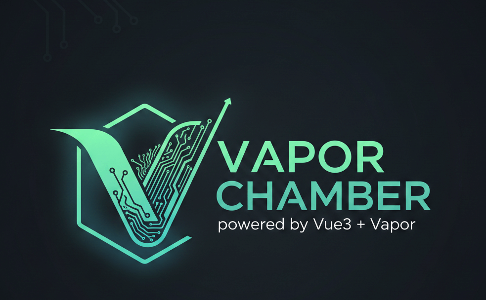

# Vapor Chamber: Design Philosophy and Architecture

<p align="center">
  
</p>

## Abstract

Vapor Chamber is a lightweight (~2KB gzipped) command bus designed for Vue Vapor, Vue's Virtual DOM-less compilation strategy. This document describes the design philosophy, architectural decisions, and technical implementation of the library.

For the Vue 3.6 Vapor alignment strategy, alien-signals integration, and migration guide, see [Whitepaper: Vue 3.6 Vapor Alignment](./whitepaper-vue36.md).

## 1. Introduction

### 1.1 The Problem

Modern frontend applications face a common architectural challenge: managing complex state transitions and side effects across many components. Traditional approaches include:

- **Event Emitters**: Scatter logic across components, making it hard to trace data flow
- **Global State Stores**: Often over-engineered for simple applications, introduce boilerplate
- **Direct Method Calls**: Create tight coupling between components

### 1.2 The Solution

Vapor Chamber introduces the **Command Bus** pattern to Vue applications:

```
User Action → Command → Handler → Result
                ↓
            Plugins (observe, validate, transform)
```

A command bus centralizes action handling while remaining lightweight and composable.

## 2. Design Principles

### 2.1 Minimal by Default

The core library (command bus + plugins + composables) weighs approximately 4KB minified / 2KB gzipped. The DevTools integration is loaded dynamically and adds zero cost to production bundles. This is achieved through:

- Zero external dependencies
- No runtime framework abstractions
- Simple data structures (Maps, Arrays)
- Tree-shakeable exports

### 2.2 Vapor-Native

Vue Vapor eliminates the Virtual DOM in favor of direct DOM updates via **signals**. As of Vue 3.6, the reactivity engine is powered by [alien-signals](https://github.com/stackblitz/alien-signals) — `ref()` is a signal internally.

Vapor Chamber aligns with this philosophy:

- Uses signal-based reactivity for composables
- Auto-detects Vue's `ref()` (alien-signals backed in 3.6+)
- Provides `defineVaporCommand()` for zero-overhead hot-path dispatch
- No VDOM reconciliation overhead
- Direct state updates without intermediate representations

### 2.3 Composition Over Configuration

Instead of a monolithic configuration object, Vapor Chamber uses composable plugins:

```typescript
const bus = createCommandBus();
bus.use(logger());           // Add logging
bus.use(validator(rules));   // Add validation
bus.use(history());          // Add undo/redo
bus.use(authGuard(opts));    // Add auth protection
bus.use(optimistic(specs));  // Add optimistic updates
```

Each plugin is independent and can be added or removed at runtime.

### 2.4 Predictable Execution

- **Synchronous by default**: `dispatch()` returns immediately with a result
- **Explicit async**: Use `createAsyncCommandBus()` when async is needed
- **Request/response**: Use `request()`/`respond()` for async query patterns
- **Result objects**: Every dispatch returns `{ ok, value?, error? }`

## 3. Architecture

### 3.1 Core Components

```
┌──────────────────────────────────────────────────────────────┐
│                       Command Bus                            │
├──────────────────────────────────────────────────────────────┤
│  Handlers Map     │  Undo Handlers  │  Plugins      │ Hooks  │
│  action → fn      │  action → fn    │  [p1, p2]     │ [h1]   │
├──────────────────────────────────────────────────────────────┤
│  Pattern Listeners │  Responders     │  Naming Conv. │       │
│  [{pat, fn}]       │  action → fn    │  { regex }    │       │
└──────────────────────────────────────────────────────────────┘
                              │
                              ▼
┌──────────────────────────────────────────────────────────────┐
│                      Dispatch Flow                           │
├──────────────────────────────────────────────────────────────┤
│  1. Validate naming convention                               │
│  2. Create Command { action, target, payload }               │
│  3. Look up handler                                          │
│  4. Build plugin chain (sorted by priority)                  │
│  5. Execute chain                                            │
│  6. Run after hooks                                          │
│  7. Notify pattern listeners                                 │
│  8. Return result                                            │
└──────────────────────────────────────────────────────────────┘
```

### 3.2 Command Structure

A command consists of three parts:

| Property | Type | Description |
|----------|------|-------------|
| `action` | `string` | Identifier for the command (e.g., `cart_add`) |
| `target` | `any` | The entity being acted upon |
| `payload` | `any?` | Additional data for the action |

This structure separates **what** (action) from **whom** (target) and **how** (payload).

### 3.3 Plugin Pipeline

Plugins form a middleware chain. On each `dispatch()`, the bus calls plugins in priority order (highest first), then the handler:

```
dispatch() → Plugin1 (p:10) → Plugin2 (p:1) → Plugin3 (p:0) → Handler
           ←                ←               ←               ←
```

The pipeline is rebuilt once when plugins are added/removed, not on every dispatch.

### 3.4 Result Type

All dispatches return a discriminated result:

```typescript
type CommandResult = {
  ok: boolean;     // Success or failure
  value?: any;     // Handler return value (if ok)
  error?: Error;   // Error thrown (if not ok)
};
```

### 3.5 Naming Convention Enforcement

Actions can be validated against a regex pattern at both `register()` and `dispatch()` time:

```typescript
const bus = createCommandBus({
  naming: {
    pattern: /^[a-z][a-z0-9]*(_[a-z][a-z0-9]*)+$/,
    onViolation: 'throw'
  }
});
```

### 3.6 Wildcard Listeners

Pattern-based event observation without being a handler:

- `'*'` — all commands
- `'shop_*'` — prefix matching
- `'cart_add'` — exact match

Listeners run after hooks and receive both the command and result.

## 4. Plugin System

### 4.1 Plugin Contract

A plugin is a function that receives a command and a `next` function:

```typescript
type Plugin = (cmd: Command, next: () => CommandResult) => CommandResult;
```

Plugins can:
- **Observe**: Log, track analytics, measure timing
- **Modify**: Transform commands before execution
- **Short-circuit**: Return early without calling `next()`
- **Transform**: Modify results after execution
- **Guard**: Block execution based on auth state

### 4.2 Built-in Plugins

| Plugin | Purpose | Key Feature |
|--------|---------|-------------|
| `logger` | Debug output | Grouped console logs |
| `validator` | Pre-execution validation | Short-circuits on failure |
| `history` | Undo/redo tracking | Bus-backed inverse execution |
| `debounce` | Rate limiting | Delays until activity stops |
| `throttle` | Rate limiting | Executes at fixed intervals |
| `authGuard` | Access control | Blocks protected actions when unauthenticated |
| `optimistic` | Optimistic UI | Applies update immediately, rolls back on error |

### 4.3 Custom Plugin Example

```typescript
const analyticsPlugin: Plugin = (cmd, next) => {
  const start = performance.now();
  const result = next();

  analytics.track({
    action: cmd.action,
    duration: performance.now() - start,
    success: result.ok
  });

  return result;
};
```

## 5. Vue Vapor Integration

### 5.1 Signal Configuration

Vapor Chamber auto-detects Vue's `ref()` at module load time via an eager `import('vue')`. In Vue 3.6+, `ref()` is backed by alien-signals, so the auto-detected signal is already optimal.

For explicit control or custom signal implementations:

```typescript
import { ref } from 'vue';
import { configureSignal } from 'vapor-chamber';
configureSignal(ref);
```

### 5.2 Lifecycle Cleanup

All composables auto-register cleanup via `onScopeDispose` (Vue 3.5+), falling back to `onUnmounted`. This works in:

- Component `setup()` (VDOM and Vapor)
- `effectScope()` contexts
- SSR environments
- Standalone test environments (via manual `dispose()`)

### 5.3 Composables

**useCommand**: Dispatch with reactive loading state
```typescript
const { dispatch, loading, lastError } = useCommand();
```

**defineVaporCommand**: Zero-overhead hot-path dispatch
```typescript
const { dispatch } = defineVaporCommand('track_scroll', (cmd) => {
  analytics.trackScroll(cmd.target.y);
});
```

**useCommandState**: State managed by commands
```typescript
const { state } = useCommandState(initial, {
  'action': (state, cmd) => newState
});
```

**useCommandHistory**: Reactive undo/redo
```typescript
const { canUndo, canRedo, undo, redo } = useCommandHistory();
```

### 5.4 Shared Bus Instance

A singleton pattern ensures all composables share the same bus:

```typescript
let sharedBus: CommandBus | null = null;

export function getCommandBus(): CommandBus {
  if (!sharedBus) {
    sharedBus = createCommandBus();
  }
  return sharedBus;
}
```

`resetCommandBus()` is provided for test teardown to prevent leaks between test files.

## 6. Async Support

### 6.1 Async Command Bus

For async handlers (API calls, IndexedDB, etc.):

```typescript
const bus = createAsyncCommandBus();

bus.register('user_fetch', async (cmd) => {
  const response = await fetch(`/api/users/${cmd.target.id}`);
  return response.json();
});

const result = await bus.dispatch('user_fetch', { id: 1 });
```

### 6.2 Request/Response Pattern

For query-style operations with timeout:

```typescript
bus.respond('get_config', async (cmd) => {
  return await fetchConfig(cmd.target.key);
});

const result = await bus.request('get_config', { key: 'theme' }, { timeout: 3000 });
```

## 7. Comparison with Alternatives

| Feature | Vapor Chamber | Vuex/Pinia | Event Bus |
|---------|--------------|------------|-----------|
| Size | ~2KB | 10-20KB | <1KB |
| Type Safety | Full | Partial | None |
| Plugin System | Yes (7 built-in) | Limited | No |
| Undo/Redo | Built-in | Manual | No |
| Auth Guard | Built-in | Manual | No |
| Optimistic Updates | Built-in | Manual | No |
| Naming Enforcement | Built-in | No | No |
| Async Support | Explicit | Implicit | N/A |
| Vue Vapor Ready | Yes (aligned) | No | N/A |
| Mixed VDOM/Vapor | Yes | No | N/A |

## 8. Performance Considerations

### 8.1 Handler Lookup

Handlers are stored in a `Map<string, Handler>` for O(1) lookup.

### 8.2 Plugin Chain

The plugin chain is built once per plugin-list change and cached as a stateful runner. On each dispatch, `cmd` and `execute` are passed as arguments — no per-dispatch closure allocation. The runner is rebuilt only when plugins are added or removed.

### 8.3 Alien-Signals Alignment

Under Vue 3.6+, `ref()` uses alien-signals internally. vapor-chamber's `useCommand()` creates `loading` and `lastError` signals. Each `.value` access adds a node to the alien-signals dependency graph. For hot-path dispatches where this overhead matters, `defineVaporCommand()` provides a zero-overhead alternative that skips signal creation entirely.

### 8.4 Memory

- Commands are plain objects (no class instances)
- History plugin limits stored commands with `maxSize`
- `onScopeDispose` / `dispose()` functions prevent memory leaks
- `resetCommandBus()` enables clean test teardown

## 9. Future Directions

### 9.1 Implemented Features

- DevTools integration — timeline + inspector, 0KB in prod
- Command batching — `dispatchBatch()` with partial results
- Middleware priority — `use(plugin, { priority })`
- Dead letter handling — `onMissing` option
- Testing utilities — `createTestBus()`
- Naming convention enforcement (v0.3.0)
- Wildcard listeners and request/response (v0.3.0)
- Auth guard and optimistic update plugins (v0.3.0)
- Vue 3.6 Vapor alignment — `onScopeDispose`, detection, `defineVaporCommand` (v0.4.0)

### 9.2 Planned Features

- Persistence plugin for localStorage/IndexedDB
- Channel-based pub/sub for cross-tab coordination

### 9.3 Vue Vapor Stabilization

As Vue Vapor moves from beta to stable, Vapor Chamber will:
- Update signal detection for official stable API
- Add full SSR support (see [docs/ssr.md](./ssr.md))
- Optimize for Vapor's compilation output
- Track alien-signals API surface changes

## 10. Conclusion

Vapor Chamber provides a minimal, composable command bus that aligns with Vue Vapor's philosophy of direct, efficient updates. By centralizing action handling and providing a powerful plugin system, it enables better architecture without sacrificing performance or simplicity. The v0.4.0 alignment with Vue 3.6 and alien-signals ensures the library is ready for the VDOM-less future while remaining fully functional in traditional Vue 3 applications.

---

## References

1. Vue 3.6 Beta Release: https://github.com/vuejs/core/releases/tag/v3.6.0-beta.1
2. Alien Signals: https://github.com/stackblitz/alien-signals
3. Vue Vapor: https://github.com/vuejs/vue-vapor
4. Command Pattern: https://en.wikipedia.org/wiki/Command_pattern
5. Middleware Pattern: https://en.wikipedia.org/wiki/Middleware

## License

GNU Lesser General Public License v2.1
